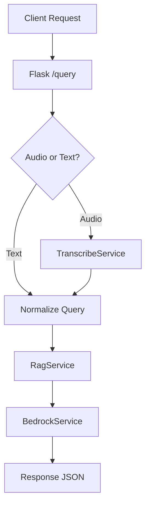
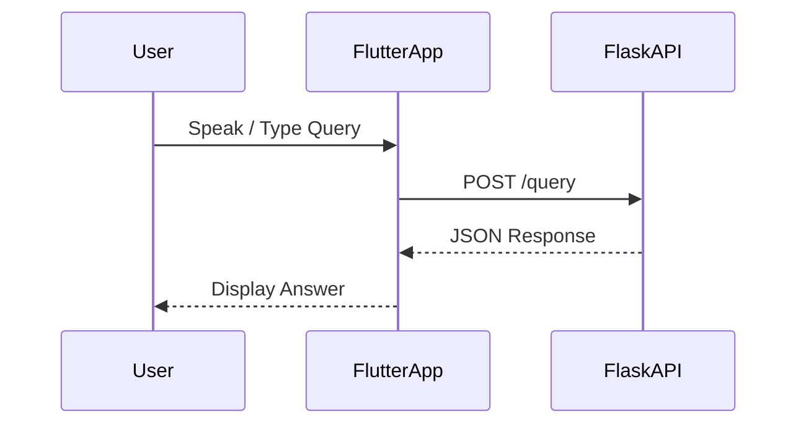
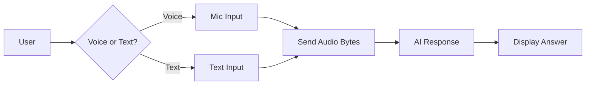

# JanSathi (जनसाथी)

## Voice-First AI Civic Assistant for India

---

## 1. Project Overview

**JanSathi** is a **voice-first, AI-powered civic assistant** designed to help Indian citizens—especially rural and semi-urban users—access government schemes, certificates, and public services **in simple language** using **voice or text**.

The core philosophy is:

> *Meet citizens where they are — voice first, low bandwidth, minimal UI, high reliability.*

JanSathi is built to work even in:

* Low-bandwidth environments
* Intermittent connectivity
* Users unfamiliar with complex apps

It supports:

* 🎙️ Voice queries
* ⌨️ Text queries
* 🌐 Web + Mobile
* 📴 Offline fallback (cached FAQs)

---

## 2. Problem Statement

Many Indian government services are:

* Fragmented across portals
* Hard to understand due to complex language
* Inaccessible to users without digital literacy

Citizens often struggle with:

* How to apply for certificates (income, caste, residence)
* Understanding eligibility for schemes
* Knowing required documents and steps

**JanSathi solves this by acting as a conversational layer** over government knowledge.

---

## 3. High-Level Solution

JanSathi provides:

1. **Voice/Text Interface** for user queries
2. **Backend AI pipeline** to:

   * Transcribe speech
   * Retrieve relevant context
   * Generate clear, human-friendly answers
3. **Graceful fallback** when AI services are unavailable

---

## 4. Tech Stack

### Frontend

* **Flutter** (Web + Android)
* `record` – microphone streaming
* `connectivity_plus` – offline detection
* `permission_handler` – mic permissions

### Backend

* **Python (Flask)**
* Modular service architecture
* AWS-ready (but not hard-dependent)

### AI / Cloud (Optional / Future)

* AWS Transcribe (Speech-to-Text)
* AWS Bedrock (LLM generation)
* AWS Polly (Text-to-Speech – optional)

> ⚠️ The system is intentionally designed to **work without AWS credentials** for hackathon demos.

---

## 5. Repository Structure

```
JanSathi/
├── backend/
│   ├── server.py                # Flask API
│   ├── lambda_handler.py        # Lambda compatibility
│   ├── requirements.txt
│   ├── utils.py                 # Logging, helpers
│   └── services/
│       ├── transcribe_service.py
│       ├── bedrock_service.py
│       ├── rag_service.py
│       └── polly_service.py     # (Optional)
│
├── frontend/
│   ├── lib/
│   │   ├── screens/
│   │   │   └── home_screen.dart
│   │   ├── services/
│   │   │   ├── api_service.dart
│   │   │   └── offline_service.dart
│   │   └── main.dart
│   └── pubspec.yaml
│
├── docs/
│   ├── architecture.md
│   ├── failure_mode_analysis.md
│   └── pitch_narration.md
│
└── README.md
```

---

## 6. Backend Architecture

### API Endpoints

| Endpoint  | Method | Purpose                             |
| --------- | ------ | ----------------------------------- |
| `/health` | GET    | Backend health check                |
| `/query`  | POST   | Main query endpoint (text or audio) |

### `/query` Input Formats

**Text (JSON):**

```json
{ "text_query": "How to apply for income certificate" }
```

**Audio (multipart/form-data):**

```
audio_file: <wav/pcm bytes>
```

### `/query` Output Format

```json
{
  "query": "...",
  "answer": "Human-readable response",
  "context": []
}
```

---

## 7. Backend Internal Flow



### Design Principles

* No infinite loops
* All temp files cleaned via `finally`
* Bounded polling for AWS calls
* Graceful mock fallback when AWS unavailable

---

## 8. Frontend Architecture

### Key Screens

* **HomeScreen** (single-screen UX)

### Frontend Responsibilities

* Handle mic permissions
* Record audio using streaming (Web-safe)
* Send queries to backend
* Display responses
* Handle offline fallback

---

## 9. Frontend → Backend Interaction



---

## 10. User Flow



---

## 11. Offline Mode

When internet is unavailable:

* App checks connectivity
* Searches cached FAQ keywords
* Returns best matching local answer

This ensures:

* No blank screen
* No crashes
* Honest UX messaging

---

## 12. Current Project Status (✅ COMPLETED)

### Backend

* ✅ Stable Flask server
* ✅ No resource leaks
* ✅ No infinite loops
* ✅ AWS-optional design
* ✅ Production-safe error handling

### Frontend

* ✅ Flutter Web compatible
* ✅ Mobile compatible
* ✅ No `dart:io`
* ✅ Web-safe audio recording
* ✅ Backend contract aligned
* ✅ No runtime crashes

### DevOps / Git

* ✅ Branch-based workflow
* ✅ Clean commit history

---

## 13. Known Non-Blocking Risks

### PCM vs WAV Header

* Frontend records PCM16 stream
* AWS Transcribe expects WAV headers

Impact:

* Transcription may fail when AWS enabled
* App **will not crash**

Fix (Future):

* Wrap PCM with WAV header on frontend
* OR accept PCM on backend

---

## 14. What Is Pending (Future Work)

### AI Enhancements

* 🔲 Enable real AWS credentials
* 🔲 Improve RAG knowledge base
* 🔲 Add multilingual support

### UX Enhancements

* 🔲 Text-to-Speech playback
* 🔲 Conversation history
* 🔲 Scheme deep-linking

### Production Readiness

* 🔲 Authentication (if needed)
* 🔲 Rate limiting
* 🔲 Deployment (EC2 / Lambda)

---

## 15. How to Run Locally

### Backend

```bash
cd backend
pip install -r requirements.txt
python server.py
```

### Frontend

```bash
cd frontend
flutter pub get
flutter run -d chrome
```

---

## 16. Project Vision

JanSathi is not just a hackathon demo.
It is designed as a **foundational civic AI layer** that can:

* Scale across states
* Support multiple dialects
* Integrate with official data sources

**Goal:** Make government services understandable, accessible, and human.

---

## 17. Authors & Contributors

* Poornachandran (Primary Developer)
* Team JanSathi

---

## 18. License

To be decided (Hackathon / Open Source).
