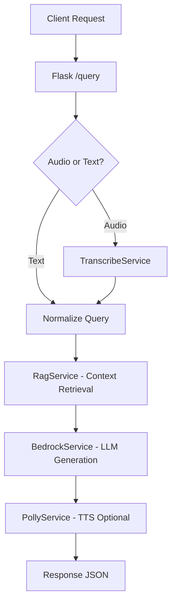
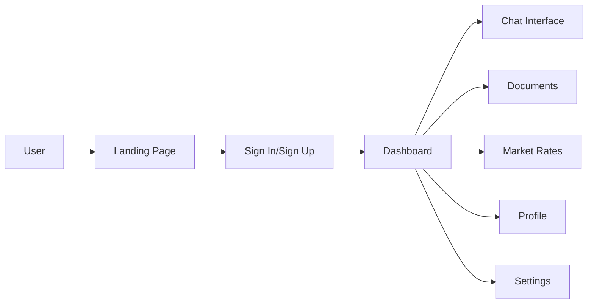
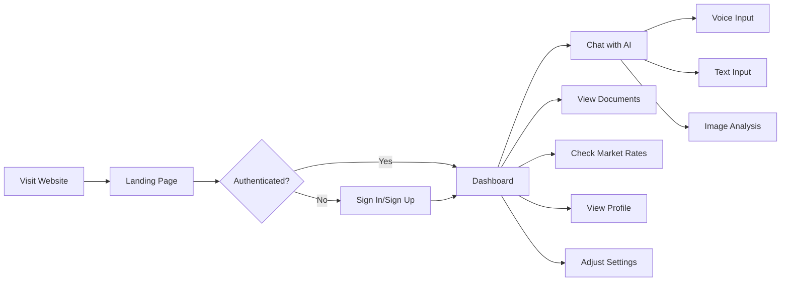

# JanSathi (जनसाथी)
## Voice-First AI Civic Assistant for India


---

## 🌟 Project Overview

**JanSathi** is a voice-first, AI-powered civic assistant designed to help Indian citizens—especially rural and semi-urban users—access government schemes, certificates, and public services in simple language using voice or text.

### Core Philosophy
> **Meet citizens where they are** — voice first, low bandwidth, minimal UI, high reliability.

JanSathi works seamlessly in:
- 📶 Low-bandwidth environments
- 🔌 Intermittent connectivity
- 👥 For users unfamiliar with complex apps

### Supported Features
- 🎙️ **Voice queries** (Speech-to-Text)
- ⌨️ **Text queries**
- 🌐 **Web interface** (primary)
- 📴 **Offline fallback** (cached FAQs)
- 🌍 **Multilingual support** (Hindi, English, Kannada, Tamil)
- 📱 **Mobile-first design**

---

## 🎯 Problem Statement

Many Indian government services are:
- **Fragmented** across multiple portals
- **Complex** with difficult-to-understand language
- **Inaccessible** to users without digital literacy

Citizens struggle with:
- ❓ How to apply for certificates (income, caste, residence)
- ❓ Understanding eligibility for schemes
- ❓ Knowing required documents and steps

**JanSathi solves this** by acting as a conversational layer over government knowledge.

---

## 🚀 Tech Stack

### Frontend (Website)
- **Framework**: Next.js 16 (React, TypeScript)
- **Styling**: Tailwind CSS with custom design system
- **UI/UX**: Glassmorphism, Aurora gradients, Premium animations
- **Speech**: Web Speech API (browser-based STT)
- **Audio**: HTML5 `<audio>` for playback
- **State Management**: React Hooks + localStorage
- **Mobile**: Fully responsive (320px - 4K)

### Backend
- **Framework**: Python Flask
- **Architecture**: Clean Architecture (API → Services → Core)
- **Database**: SQLite with SQLAlchemy ORM
- **Server**: Gunicorn with async workers
- **Security**: Talisman, CORS, Rate Limiting
- **Logging**: JSON-based structured logging

### AI / Cloud Services
- **Transcription**: AWS Transcribe (Speech-to-Text)
- **LLM**: AWS Bedrock (Claude/Titan models)
- **TTS**: AWS Polly (Neural voices)
- **Search**: AWS Kendra (RAG retrieval)
- **Fallback**: Local mock mode when AWS unavailable

---

## 📁 Repository Structure

```
JanSathi/
├── backend/
│   ├── main.py                     # Production entry point
│   ├── app/
│   │   ├── api/                    # Flask Blueprints (routes.py)
│   │   ├── services/               # Business logic (AWS integrations)
│   │   ├── models/                 # SQLAlchemy models
│   │   └── core/                   # Config, utils, logging
│   ├── Dockerfile                  # Production container
│   ├── requirements.txt
│   └── lambda_handler.py           # AWS Lambda entry point
│
├── frontend/
│   ├── src/
│   │   ├── app/                    # Next.js App Router
│   │   │   ├── page.tsx           # Landing page
│   │   │   ├── sign-in/           # Authentication pages
│   │   │   ├── sign-up/
│   │   │   └── dashboard/         # Main dashboard
│   │   ├── components/
│   │   │   ├── features/
│   │   │   │   ├── chat/          # Chat interface + Voice input
│   │   │   │   └── dashboard/     # Documents, Profile, Settings
│   │   │   ├── layout/            # Sidebar, Telemetry, Header
│   │   │   └── ui/                # Reusable components
│   │   ├── services/              # API client (Axios)
│   │   ├── hooks/                 # Custom React hooks (useAuth, useSettings)
│   │   └── styles/                # Global CSS
│   ├── public/                     # Static assets
│   ├── Dockerfile                  # Production Next.js container
│   └── package.json
│
├── docs/
│   ├── AUTHENTICATION_GUIDE.md    # Auth integration guide
│   ├── AUTH_PAGES_README.md       # Auth pages documentation
│   └── MOBILE_FIXES_SUMMARY.md    # Mobile optimization log
│
└── README.md                       # This file
```

---

## 🏗️ Architecture

### Backend API Flow



### Frontend Architecture



---

## 🎨 UI/UX Features (v2.0 - Latest Updates)

### ✅ Completed Features

#### **Landing Page**
- ✨ Modern hero section with animated gradients
- ✨ Feature showcase grid (Voice AI, Document Analysis, Multilingual)
- ✨ Tech stack section with AWS branding
- ✨ **Mobile-optimized**: Responsive text sizing and layouts
- ✨ **Fixed typo**: "Government" (was "Govenment")
- ✨ Sign In/Sign Up buttons in navbar

#### **Authentication System (NEW!)**
- 🔐 **Sign In Page** (`/sign-in`)
  - Email & password login
  - Google Sign In button (demo)
  - Remember me checkbox
  - Forgot password link
  - Modern glassmorphism UI
  - Form validation & error handling

- 🔐 **Sign Up Page** (`/sign-up`)
  - Full registration form (name, email, password)
  - Password confirmation & strength validation
  - Terms & conditions acceptance
  - Google Sign Up option
  - Comprehensive client-side validation

- 🔐 **Authentication Features**
  - Demo mode using localStorage (ready for production auth)
  - Sign Out functionality
  - useAuth hook for state management
  - Supports Clerk, NextAuth, Firebase, Supabase integration

#### **Chat Interface**
- 💬 Typewriter effect for AI responses
- 💬 Voice input with visual feedback
- 💬 Image analysis integration
- 💬 Government scheme cards with benefits
- 💬 Session management
- 💬 **Mobile-optimized**: Message bubbles adapt to screen size
- 💬 **Improved spacing**: Better padding on mobile devices

#### **Dashboard Pages**
- 📄 **Documents Page**: Official guidelines + upload for AI analysis
- 📊 **Market Rates**: Live Mandi prices (demo data)
- 👤 **Profile Page**: User stats, badges, preferences
- ⚙️ **Settings Page**: Language, theme, voice preferences
- 📡 **Telemetry Panel**: AWS service status (desktop only)

#### **Mobile Responsiveness (MAJOR UPDATE)**
- ✅ **All pages fully responsive** (320px → 4K displays)
- ✅ **Vertical alignment fixed** across all pages
- ✅ **Adaptive layouts**: Grids stack on mobile
- ✅ **Touch-friendly**: Buttons sized for mobile interaction
- ✅ **Viewport meta tag**: Proper mobile scaling
- ✅ **Responsive text**: Scales from sm → lg → xl
- ✅ **Horizontal scroll**: Tables adapt on small screens

#### **Design System**
- 🎨 Custom glassmorphism effects
- 🎨 Aurora gradient background
- 🎨 Consistent color palette (Blue, Purple, Emerald accents)
- 🎨 Modern typography (Geist Sans font family)
- 🎨 Smooth animations and transitions
- 🎨 Dark mode optimized

---

## 🔌 API Endpoints

| Endpoint | Method | Purpose |
|----------|--------|---------|
| `/health` | GET | Backend health check |
| `/query` | POST | Main query endpoint (text or audio) |
| `/history` | GET | Retrieve past queries (optional) |

### `/query` Input Formats

**Text (JSON):**
```json
{
  "text_query": "How to apply for income certificate",
  "language": "en"
}
```

**Audio (multipart/form-data):**
```
audio_file: <wav/pcm bytes>
```

### `/query` Output Format

```json
{
  "query": "User query text",
  "answer": "Human-readable response",
  "audio_url": "https://...",
  "context": ["source1", "source2"],
  "structured_sources": [...]
}
```

---

## 🚀 Getting Started

### Prerequisites
- **Node.js** 18+ (for frontend)
- **Python** 3.9+ (for backend)
- **npm** or **pnpm** (package manager)

### Quick Start

#### 1. Backend Setup
```bash
cd backend
pip install -r requirements.txt
python main.py
```
Backend runs on `http://localhost:5000`

#### 2. Frontend Setup
```bash
cd frontend
npm install
npm run dev
```
Frontend runs on `http://localhost:3000`

#### 3. Environment Variables

**Frontend (`.env.local`):**
```bash
# Backend API
NEXT_PUBLIC_API_URL=http://localhost:5000

# Authentication (Optional - currently in demo mode)
# NEXT_PUBLIC_CLERK_PUBLISHABLE_KEY=pk_test_...
# CLERK_SECRET_KEY=sk_test_...
```

**Backend (`.env` or environment):**
```bash
# AWS Credentials (Optional - has mock fallback)
AWS_ACCESS_KEY_ID=your_key
AWS_SECRET_ACCESS_KEY=your_secret
AWS_REGION=ap-south-1

# Flask Config
FLASK_ENV=development
```

---

## 📱 Mobile Optimization Highlights

### Responsive Breakpoints
- **Mobile**: `< 640px` (base styles)
- **Tablet**: `sm: >= 640px`
- **Laptop**: `md: >= 768px`
- **Desktop**: `lg: >= 1024px`
- **Large**: `xl: >= 1280px`

### Key Improvements
1. **Landing Page**: Hero text scales from `text-4xl` → `text-8xl`
2. **Chat Interface**: Message bubbles use 95% width on mobile
3. **Documents Grid**: 1 column mobile → 3 columns desktop
4. **Input Controls**: Touch-friendly button sizes
5. **Tables**: Horizontal scroll on mobile
6. **Navigation**: Hamburger menu for mobile sidebar

---

## 🔐 Authentication & Security

### Current Implementation (Demo Mode)
- Uses **localStorage** for demo purposes
- No backend authentication required
- Perfect for testing and prototyping

### Production Ready Options
Refer to `AUTHENTICATION_GUIDE.md` for detailed integration guides:
- **Clerk** (Recommended - easiest setup)
- **NextAuth.js** (Free, open-source)
- **Firebase Auth** (Google's solution)
- **Supabase Auth** (Open-source alternative)

### Sign Out Flow
1. User clicks "Sign Out" in sidebar
2. localStorage cleared
3. Redirect to `/sign-in`
4. All sessions terminated

---

## 🎯 User Flow



---

## ✅ Production Readiness Checklist

### Backend
- ✅ Clean Architecture (API, Services, Core layers)
- ✅ Modular Flask Blueprints
- ✅ Docker containerization (Gunicorn + async workers)
- ✅ Enterprise security (Talisman, CORS, Rate Limiting)
- ✅ Structured JSON logging (CloudWatch ready)
- ✅ AWS integration with graceful fallbacks
- ✅ Health check endpoints

### Frontend
- ✅ Next.js 16 with App Router
- ✅ TypeScript for type safety
- ✅ Responsive design (mobile-first)
- ✅ Error boundaries for stability
- ✅ Authentication system (demo + integration ready)
- ✅ Optimized production build
- ✅ Docker multi-stage builds
- ✅ SEO-friendly meta tags
- ✅ Accessibility considerations

### UI/UX
- ✅ Premium glassmorphism design
- ✅ Multilingual support (4+ languages)
- ✅ Voice input/output
- ✅ Session management
- ✅ Loading states and animations
- ✅ Error handling with user-friendly messages
- ✅ Mobile-optimized layouts
- ✅ Touch-friendly interactions

---

## 🔄 Recent Updates (v2.0)

### Latest Changes (Feb 2026)
1. ✨ **Authentication System**
   - Created professional sign-in and sign-up pages
   - Added Google OAuth buttons (demo)
   - Implemented sign-out functionality
   - Created useAuth hook for state management

2. ✨ **Mobile Responsiveness**
   - Fixed vertical alignment across all pages
   - Responsive text sizing (mobile → desktop)
   - Adaptive grid layouts
   - Touch-friendly button sizing
   - Horizontal scroll for tables on mobile

3. ✨ **UI Improvements**
   - Fixed "Government" typo on landing page
   - Updated navbar with Sign In/Sign Up buttons
   - Improved chat message bubble widths
   - Better spacing on mobile devices
   - Enhanced welcome screen

4. ✨ **Code Quality**
   - Removed Clerk dependencies (shifted to demo mode)
   - Cleaned up imports and unused code
   - Added comprehensive documentation
   - Created authentication integration guide

---

## 📚 Documentation

- **`AUTHENTICATION_GUIDE.md`** - How to integrate real authentication providers
- **`AUTH_PAGES_README.md`** - Quick reference for auth pages and features
- **`MOBILE_FIXES_SUMMARY.md`** - Summary of mobile optimization work
- **`HACKATHON_SUBMISSION.md`** - Hackathon-ready project overview

---

## 🎬 Demo Scenarios

### Scenario 1: Applying for Income Certificate
```
User: "मुझे आय प्रमाण पत्र कैसे मिलेगा?"
(How do I get an income certificate?)

JanSathi: Provides step-by-step guidance in Hindi, 
including required documents, online portal link, 
and expected processing time.
```

### Scenario 2: Checking Mandi Rates
```
User: "What are today's wheat prices?"

JanSathi: Returns live/demo mandi rates for wheat
across different markets with comparative analysis.
```

### Scenario 3: Document Analysis
```
User: Uploads ration card image

JanSathi: Analyzes document using Vision AI,
extracts key information, and suggests relevant
schemes based on family composition.
```

---

## 🐛 Known Issues & Limitations

### Non-Blocking
- ⚠️ Browser Speech API performance varies on non-Chromium browsers
- ⚠️ AWS services require credentials (has mock fallback)
- ⚠️ Demo authentication uses localStorage (not for production)

### Future Enhancements
- 🔲 Password reset functionality
- 🔲 Email verification flow
- 🔲 Real-time mandi price updates
- 🔲 PDF export for scheme details
- 🔲 Push notifications for scheme updates
- 🔲 Offline PWA support

---

## 🚧 Next Steps

### Immediate
1. Integrate production authentication provider
2. Connect to real government data APIs
3. Add unit and integration tests
4. Set up CI/CD pipeline

### Short-term
1. Implement acoustic fine-tuning for rural accents
2. Add multimodal PDF processing
3. Expand language support (10+ languages)
4. Mobile app (React Native/Flutter)

### Long-term
1. WhatsApp bot integration
2. SMS fallback for feature phones
3. State-specific customization
4. Integration with official government portals

---

## 📄 License

MIT License (Open Source)

---

## 🙏 Acknowledgments

- Government of India's Digital India initiative
- AWS for cloud infrastructure
- Open-source community for tools and libraries

---

## 📞 Support

For questions or support:
- 📧 Email: support@jansathi.ai (placeholder)
- 💬 WhatsApp: +91-1234567890 (demo)
- 🌐 Website: https://jansathi.ai (coming soon)

---

**Built with ❤️ for Digital India**


