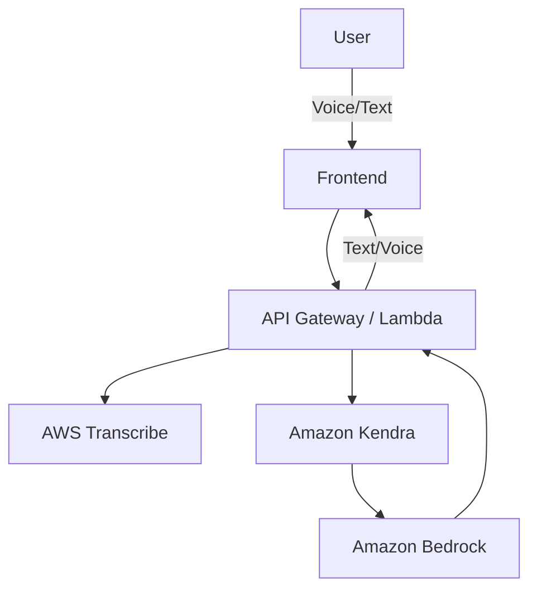
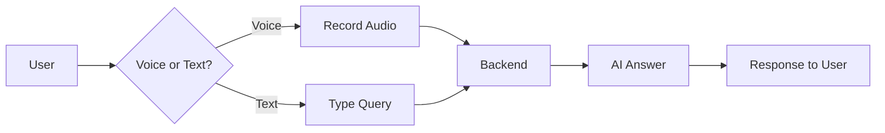

# JanSathi (जनसाथी)

## A Multilingual, Voice-First AI Civic Assistant for India

---

## 1. The Core Problem — Why JanSathi Is Needed

In India, **public information exists, but access does not**.

Government schemes, healthcare guidelines, scholarships, market prices, and advisories are:

* Written mainly in **English or Hindi**
* Spread across **complex, fragmented portals**
* Difficult to navigate even for digitally literate users

### Ground Reality

* Only **~11% of Indians speak English**
* Large sections of the population face:

  * Low literacy
  * Low bandwidth
  * Low digital skills

As a result:

* Farmers travel to offices just to ask market prices
* Health workers struggle to find updated guidelines
* Students miss scholarships due to lack of awareness

This creates a **language + literacy + connectivity gap**, disproportionately affecting:

* Farmers
* Community health workers
* Rural students
* Marginalized communities

---

## 2. The Solution — One Line

**JanSathi is a multilingual, voice-first AI assistant that lets people ask civic questions in their own language and receive simple, reliable answers — even with low internet or basic devices.**

> *Think of JanSathi as a digital government helper that speaks your language and works where the internet doesn’t.*

---

## 3. What JanSathi Actually Does (Plain Explanation)

Users can ask questions such as:

* “Am I eligible for PM-Kisan?”
* “What is today’s wheat price in my mandi?”
* “Which scholarships can I apply for after 12th?”
* “What maternal health schemes apply in my village?”

They can ask via:

* 🎙️ Voice or ⌨️ text
* Multiple Indian languages (Hindi, Tamil, Telugu, Bengali, etc.)
* Mobile app, WhatsApp, SMS, or even a phone call (IVR)

JanSathi:

1. Understands the **local language**
2. Identifies **user intent**
3. Retrieves **relevant public data**
4. Responds **clearly and briefly in the same language**
5. Can **speak the answer aloud** if needed

---

## 4. Real Users — Why This Is Practical

### 👨‍🌾 Ramesh — Farmer (Hindi)

* Uses a basic Android phone
* Not tech-savvy, not English-speaking
* Asks:

  > “इस महीने गेहूँ का भाव क्या है?”
* Gets a **spoken answer in Hindi**

### 👩‍⚕️ Priya — Community Health Worker (Telugu)

* Needs maternal health & COVID guidelines
* Uses voice queries
* Gets **step-by-step instructions in Telugu**
* App works with **intermittent internet**

### 🎓 Amit — Student (Bengali)

* Uses WhatsApp
* Asks about scholarships & exams
* Gets guidance in Bengali **without browsing multiple sites**

---

## 5. How JanSathi Works (Judge-Friendly Overview)

High-level workflow:

1. User asks a question (voice or text)
2. System detects language
3. AI understands intent
4. Relevant government data is retrieved
5. AI generates a short, accurate answer
6. Answer is returned as:

   * Text
   * Voice
   * SMS / IVR (for low bandwidth)

This uses **Retrieval-Augmented Generation (RAG)**, ensuring answers are **grounded in real data**, not hallucinations.

---

## 6. Key Differentiators

* ✅ Multilingual **by design** (not English-first)
* ✅ Voice-first UX
* ✅ Offline & low-bandwidth support
* ✅ Works on WhatsApp, SMS, IVR
* ✅ Proactive alerts (schemes, weather, health camps)
* ✅ Built for Indian realities, not urban assumptions

> JanSathi is not just a chatbot — it is a **civic assistant**.

---

## 7. Complete Technology Stack

### 7.1 Frontend — User Interaction Layer

#### 📱 Mobile & Web App

* **Flutter** (Android, iOS, Web)

**Why Flutter?**

* Single codebase
* Lightweight UI (low-end phones)
* Excellent voice & offline support
* Faster hackathon development

Used for:

* Voice recording
* Text chat
* Offline cached FAQs

#### 💬 Messaging Interface

* **WhatsApp Cloud API**

Why WhatsApp?

* Already used by rural users
* No new app install
* Low bandwidth friendly
* High demo impact

#### ☎️ IVR / Phone Call (Optional)

* **Amazon Connect**
* Enables toll-free voice access

---

### 7.2 Backend — Fast & Serverless

* **AWS API Gateway + AWS Lambda**

Responsibilities:

* Receive queries
* Route to AI services
* Return responses
* Log usage

---

### 7.3 AI & Language Intelligence

#### 🧠 Large Language Model

* **Amazon Bedrock (Claude / Llama-3)**

Used for:

* Intent understanding
* Multilingual responses
* Multi-turn conversations

#### 📚 Retrieval (Accuracy Layer)

* **Amazon Kendra**
* Alternative: OpenSearch + embeddings

Ensures:

* No hallucination
* Answers grounded in official documents

---

### 7.4 Voice & Language Processing

* **AWS Transcribe** — Speech → Text
* **AWS Polly** — Text → Speech
* **Amazon Translate / Bedrock** — Language handling

---

### 7.5 Data Storage

* **Amazon DynamoDB** — user profiles, preferences
* **Amazon S3** — scheme PDFs, FAQs, documents

---

### 7.6 Offline & Low-Bandwidth Support

* On-device cached top civic FAQs
* Rule-based offline fallback
* Syncs when connectivity returns

---

## 8. System Architecture Diagram

---

## 9. User Flow Diagram

---

## 10. Current Project Status (So Far)

### ✅ Completed

**Backend**

* Stable API
* No infinite loops
* Safe temp-file handling
* AWS-optional fallback logic

**Frontend**

* Flutter Web + Android compatible
* Web-safe audio recording
* Offline fallback
* Backend contract aligned

**Documentation**

* Architecture
* Failure mode analysis
* Complete README

---

## 11. What Is Pending

* 🔲 Add real AWS credentials
* 🔲 Enable real AWS Transcribe & Bedrock
* 🔲 Integrate Amazon Kendra with real documents
* 🔲 Add WhatsApp & IVR integration
* 🔲 Improve multilingual coverage
* 🔲 Production deployment

---

## 12. Important Note on AWS Credentials

⚠️ **This project is designed to run on AWS**, but:

* AWS credentials have **NOT been added yet**
* Current system uses **safe mock / fallback logic**
* This allows:

  * Hackathon demos
  * Local testing
  * No accidental cloud costs

Once AWS credentials are added, the system will seamlessly switch to real AI services.

---

## 13. Vision

JanSathi aims to become:

* A national-scale civic AI
* Accessible across languages & devices
* A trusted interface between citizens and the government

**Goal:** Make governance understandable, inclusive, and human.

---

## 14. Authors

* **Poornachandran** — Primary Developer
* Team JanSathi
