# JanSathi (जनसाथी)
## Voice-First AI Civic Assistant for India


---

## 🌟 Project Overview

**JanSathi** is a voice-first, AI-powered civic assistant designed to help Indian citizens—especially rural and semi-urban users—access government schemes, certificates, and public services in simple language using voice or text.

### Core Philosophy
> **Meet citizens where they are** — voice first, low bandwidth, minimal UI, high reliability.

JanSathi works seamlessly in:
- 📶 Low-bandwidth environments
- 🔌 Intermittent connectivity
- 👥 For users unfamiliar with complex apps

### Scenario Highlights
- 🎙️ **Voice queries** (Speech-to-Text)
- 🖥️ **Vision AI** (Extract Scheme info from Ration/Caste cards)
- 👆 **One-Click Apply** (Agentic Form Filling)

---

## 🏆 Hackathon Judges
**[>>> Click here for the detailed HACKATHON SUBMISSION GUIDE <<<](docs/HACKATHON_SUBMISSION.md)**
*Detailed mapping of features to Technical Excellence, Innovation, Impact, and Completeness criteria.*

---

## 📐 System Design & Diagrams

### 🏗️ Architecture diagram of the proposed solution:


### 🔄 Process flow diagram or Use-case diagram:

```mermaid
%%{init: {'theme': 'base', 'themeVariables': { 'primaryColor': '#ffffff', 'edgeLabelBackground':'#ffffff', 'tertiaryColor': '#ffffff', 'mainBkg': '#ffffff', 'clusterBkg': '#ffffff', 'nodeBorder': '#333333', 'clusterBorder': '#333333', 'lineColor': '#333333', 'fontFamily': 'arial', 'fontSize': '14px'}}}%%
graph LR
    %% Styles
    classDef start fill:#dcfce7,stroke:#166534,stroke-width:2px,color:#000
    classDef process fill:#dbeafe,stroke:#1e40af,stroke-width:2px,color:#000
    classDef decision fill:#ffedd5,stroke:#c2410c,stroke-width:2px,color:#000,shape:rhombus
    classDef ai fill:#f3e8ff,stroke:#6b21a8,stroke-width:2px,color:#000
    classDef storage fill:#fef9c3,stroke:#a16207,stroke-width:2px,color:#000
    classDef endnode fill:#fee2e2,stroke:#b91c1c,stroke-width:2px,color:#000

    %% Nodes
    A[👤 Citizen Login / Dashboard]:::start
    B[🎙️ Voice Query / Upload]:::start
    C[🌐 Speech-to-Text]:::process
    D{Intent Analysis?}:::decision
    
    %% Semantic Search Flow
    E[📚 Kendra Retrieval]:::ai
    F[🧠 Bedrock LLM Reasoner]:::ai
    G[🔊 Polly TTS]:::process
    
    %% Eligibility Flow
    H[📄 Vision OCR]:::ai
    I{Document Valid?}:::decision
    J[🧮 Criteria Matching]:::process
    K[🌸 Federated Learning Update]:::ai
    L[⚖️ XAI Explanation]:::process

    %% Database
    DB[(�️ User History)]:::storage
    
    %% Connections
    A --> B
    B --> C
    C --> D
    
    %% Branch 1: Search
    D -- "General Query" --> E
    E --> F
    F --> G
    
    %% Branch 2: Eligibility Check
    D -- "Check Eligibility" --> H
    H --> I
    I -- "Yes" --> J
    I -- "No" --> B
    J --> K
    J --> L
    L --> F
    
    %% Final Output
    G --> End[📱 App Response]:::endnode
    F --> DB
```


### 🛠️ Advanced Tech Stack Taxonomy:
| **🛸 Orchestration & FL** | **⚖️ Trust & XAI** | **🏗️ Core Services** |
| :---: | :---: | :---: |
|  |  |  |
|  |  |  |
|  |  |  |

---

## 🎯 Problem Statement

Many Indian government services are:
- **Fragmented** across multiple portals
- **Complex** with difficult-to-understand language
- **Inaccessible** to users without digital literacy

Citizens struggle with:
- ❓ How to apply for certificates (income, caste, residence)
- ❓ Understanding eligibility for schemes
- ❓ Knowing required documents and steps

**JanSathi solves this** by acting as a conversational layer over government knowledge.

---

## �️ Advanced Tech Stack Taxonomy

JanSathi is built using a decentralized, high-availability architecture that balances premium modern web capabilities with robust, low-latency AI orchestration.

### 🌐 Frontend Ecosystem
| Category | Technology | Usage in JanSathi |
| :--- | :--- | :--- |
| **Framework** |  | Server-Side Rendering (SSR), App Router, ISR for instant scheme loads. |
| **Language** |  | End-to-end type safety for mission-critical reliability. |
| **Styling** |  | Utility-first styling for glassmorphic and responsive UI. |
| **Animations** |  | Premium micro-interactions and smooth layout transitions. |
| **Auth** |  | Multi-factor authentication, Google SSO, and user session management. |
| **PWA** |  | Offline-first service worker for rural/low-connectivity caching. |
| **Speech** | **Web Speech API** | Browser-native Speech-to-Text and Text-to-Speech for low latency. |
| **Icons** | **Lucide React** | Consistent, high-fidelity iconography. |

### ⚙️ Backend & Orchestration
| Category | Technology | Usage in JanSathi |
| :--- | :--- | :--- |
| **Runtime** |  | Core logic, AI service integration, and data processing. |
| **Web Framework** |  | High-performance REST API with blueprint modularity. |
| **Orchestrator** |  | Complex state management for scheme application workflows. |
| **Server** | **Gunicorn + Async workers** | Production-grade WSGI server with concurrency support. |
| **Security** | **Flask-Talisman / CORS** | Automated security headers and cross-origin protection. |

### 🤖 Artificial Intelligence & Machine Learning
| Category | Technology | Usage in JanSathi |
| :--- | :--- | :--- |
| **Reasoning** |  | Orchestrating Claude 3.5 Sonnet for conversational logic. |
| **RAG Engine** |  | Semantic search and retrieval over official government corpus. |
| **Speech Processing** |  | Real-time multi-lingual speech-to-text for 12+ Indian dialects. |
| **Voice Synthesis** |  | Neural TTS (Aditi/Raveena) for human-like voice response. |
| **Privacy ML** |  | Federated Learning for on-device dialect adaptation. |
| **XAI** |  | Explainable AI metrics for bias detection and citation audit. |

### ☁️ Cloud Infrastructure (AWS Native)
| Service | Purpose | Specific Implementation |
| :--- | :--- | :--- |
| **API Gateway** | Entry Point | Managed REST endpoints with throttling and WAF protection. |
| **Lambda** | Compute | Serverless horizontal scaling with sub-second cold starts. |
| **S3** | Storage | High-durability storage for audio caches and document uploads. |
| **DynamoDB** | Database | High-scale NoSQL persistence for chat sessions (20%+ read hits). |
| **CloudFront** | Edge Delivery | Global CDN for static asset distribution and edge-side auth. |
| **EventBridge** | Event Bus | Decoupling agent actions from telemetry and notification services. |
| **Secret Manager** | Security | Dynamic rotation of API keys and AWS credentials. |

### 📊 Observability & DevOps
| Category | Tool | Function |
| :--- | :--- | :--- |
| **Tracing** | **AWS X-Ray** | Distributed request tracing across Lambda, Bedrock, and Kendra. |
| **Logging** | **CloudWatch Logs** | Centralized, encrypted JSON-structured logging. |
| **Analytics** | **QuickSight** | Executive BI dashboards for government outreach impact. |
| **CI/CD** |  | Automated testing, linting, and multi-region AWS deployment. |
| **IaC** | **AWS CDK** | Infrastructure-as-Code for 100% reproducible environments. |
| **Containerization** |  | Multi-stage builds for consistent local and cloud execution. |

---

## 📁 Repository Structure

```
JanSathi/
├── backend/
│   ├── main.py                     # Production entry point
│   ├── app/
│   │   ├── api/                    # Flask Blueprints (routes.py)
│   │   ├── services/               # Business logic (AWS integrations)
│   │   ├── models/                 # SQLAlchemy models
│   │   └── core/                   # Config, utils, logging
│   ├── Dockerfile                  # Production container
│   ├── requirements.txt
│   └── lambda_handler.py           # AWS Lambda entry point
│
├── frontend/
│   ├── src/
│   │   ├── app/                    # Next.js App Router
│   │   │   ├── page.tsx           # Landing page
│   │   │   ├── sign-in/           # Authentication pages
│   │   │   ├── sign-up/
│   │   │   └── dashboard/         # Main dashboard
│   │   ├── components/
│   │   │   ├── features/
│   │   │   │   ├── chat/          # Chat interface + Voice input
│   │   │   │   └── dashboard/     # Documents, Profile, Settings
│   │   │   ├── layout/            # Sidebar, Telemetry, Header
│   │   │   └── ui/                # Reusable components
│   │   ├── services/              # API client (Axios)
│   │   ├── hooks/                 # Custom React hooks (useAuth, useSettings)
│   │   └── styles/                # Global CSS
│   ├── public/                     # Static assets
│   ├── Dockerfile                  # Production Next.js container
│   └── package.json
│
├── docs/                           # Consolidated Documentation & Guides
│   ├── AUTHENTICATION_GUIDE.md    # Auth integration guide
│   ├── HACKATHON_SUBMISSION.md    # Hackathon-ready project overview
│   ├── AWS_SETUP_GUIDE.md         # AWS infrastructure setup guide
│   ├── KENDRA_SETUP_GUIDE.md      # Detailed Kendra RAG integration
│   ├── design.md                  # Detailed system design & schemas
│   └── requirements.md            # Business & technical requirements
│
├── infrastructure/                 # Infrastructure-as-Code (AWS CDK)
├── scripts/                        # Setup, Monitoring & Testing utilities
└── README.md                       # Main Entry Point
```

---

### 🏗️ JanSathi Ecosystem & Technical Flow


### Technical Infrastructure Details
> **Implementation Note**: The following diagrams represent the transition towards the full [AWS Production Architecture](docs/AWS_PRODUCTION_ARCHITECTURE.md) implemented in v2.5.

#### **Backend Production Pipeline**


#### **AWS Cloud Stack**


---

## 🎨 UI/UX Features (v2.0 - Latest Updates)

### ✅ Completed Features

#### **Landing Page**
- ✨ Modern hero section with animated gradients
- ✨ Feature showcase grid (Voice AI, Document Analysis, Multilingual)
- ✨ Tech stack section with AWS branding
- ✨ **Mobile-optimized**: Responsive text sizing and layouts
- ✨ **Fixed typo**: "Government" (was "Govenment")
- ✨ Sign In/Sign Up buttons in navbar

#### **Authentication System (NEW!)**
- 🔐 **Sign In Page** (`/sign-in`)
  - Email & password login
  - Google Sign In button (demo)
  - Remember me checkbox
  - Forgot password link
  - Modern glassmorphism UI
  - Form validation & error handling

- 🔐 **Sign Up Page** (`/sign-up`)
  - Full registration form (name, email, password)
  - Password confirmation & strength validation
  - Terms & conditions acceptance
  - Google Sign Up option
  - Comprehensive client-side validation

- 🔐 **Authentication Features**
  - Demo mode using localStorage (ready for production auth)
  - Sign Out functionality
  - useAuth hook for state management
  - Supports Clerk, NextAuth, Firebase, Supabase integration

#### **Chat Interface**
- 💬 Typewriter effect for AI responses
- 💬 Voice input with visual feedback
- 💬 Image analysis integration
- 💬 Government scheme cards with benefits
- 💬 Session management
- 💬 **Mobile-optimized**: Message bubbles adapt to screen size
- 💬 **Improved spacing**: Better padding on mobile devices

#### **Dashboard Pages**
- 📄 **Documents Page**: Official guidelines + upload for AI analysis
- 📊 **Market Rates**: Live Mandi prices (demo data)
- 👤 **Profile Page**: User stats, badges, preferences
- ⚙️ **Settings Page**: Language, theme, voice preferences
- 📡 **Telemetry Panel**: AWS service status (desktop only)

#### **Production Security (NEW!)**
- 🛡️ **Prompt Injection Defense**: Multi-pattern regex & length validation to block jailbreaks.
- 🛡️ **PII Anonymization**: Automatic HMAC-SHA256 hashing for Aadhaar and masking for phone/email.
- 🛡️ **Content Moderation**: Simulated keyword safety checks (ready for AWS Comprehend).
- 🛡️ **Response Sanitization**: Automated removal of internal PII and system markers from AI output.

#### **Observability & Ops**
- 📡 **X-Ray Tracing**: Full request lifecycle visibility with simulated distributed tracing.
- 📡 **AI Quality Monitor**: Drift detection and confidence-based human-audit flagging.
- 📡 **Structured Logging**: CloudWatch-ready JSON logging for all system events.

#### **Stakeholder Differentiators**
- 📞 **Voice-First IVR**: Simulated citizen outreach via phone channels (AWS Connect flow).
- 💬 **WhatsApp Outreach**: Citizen engagement simulator for high-accessibility channels.
- 👥 **Community Moderation**: Human-in-the-loop interface for auditing flagged AI responses.

#### **Mobile Responsiveness (MAJOR UPDATE)**
- ✅ **All pages fully responsive** (320px → 4K displays)
- ✅ **Vertical alignment fixed** across all pages
- ✅ **Adaptive layouts**: Grids stack on mobile
- ✅ **Touch-friendly**: Buttons sized for mobile interaction
- ✅ **Viewport meta tag**: Proper mobile scaling
- ✅ **Responsive text**: Scales from sm → lg → xl
- ✅ **Horizontal scroll**: Tables adapt on small screens

#### **Design System**
- 🎨 Custom glassmorphism effects
- 🎨 Aurora gradient background
- 🎨 Consistent color palette (Blue, Purple, Emerald accents)
- 🎨 Modern typography (Geist Sans font family)
- 🎨 Smooth animations and transitions
- 🎨 Dark mode optimized

---

## 🔌 API Endpoints

| Endpoint | Method | Purpose |
|----------|--------|---------|
| `/health` | GET | Backend health check |
| `/query` | POST | Main query endpoint (text or audio) |
| `/history` | GET | Retrieve past queries (optional) |

### `/query` Input Formats

**Text (JSON):**
```json
{
  "text_query": "How to apply for income certificate",
  "language": "en"
}
```

**Audio (multipart/form-data):**
```
audio_file: <wav/pcm bytes>
```

### `/query` Output Format

```json
{
  "query": "User query text",
  "answer": "Human-readable response",
  "audio_url": "https://...",
  "context": ["source1", "source2"],
  "structured_sources": [...]
}
```

---

## 🚀 Getting Started

### Prerequisites
- **Node.js** 18+ (for frontend)
- **Python** 3.9+ (for backend)
- **npm** or **pnpm** (package manager)

### Quick Start

#### 1. Backend Setup
```bash
cd backend
pip install -r requirements.txt
python main.py
```
Backend runs on `http://localhost:5000`

#### 2. Frontend Setup
```bash
cd frontend
npm install
npm run dev
```
Frontend runs on `http://localhost:3000`

#### 3. Environment Variables

**Frontend (`.env.local`):**
```bash
# Backend API
NEXT_PUBLIC_API_URL=http://localhost:5000

# Authentication (Optional - currently in demo mode)
# NEXT_PUBLIC_CLERK_PUBLISHABLE_KEY=pk_test_...
# CLERK_SECRET_KEY=sk_test_...
```

**Backend (`.env` or environment):**
```bash
# AWS Credentials (Optional - has mock fallback)
AWS_ACCESS_KEY_ID=your_key
AWS_SECRET_ACCESS_KEY=your_secret
AWS_REGION=ap-south-1

# Flask Config
FLASK_ENV=development
```

---

## 📱 Mobile Optimization Highlights

### Responsive Breakpoints
- **Mobile**: `< 640px` (base styles)
- **Tablet**: `sm: >= 640px`
- **Laptop**: `md: >= 768px`
- **Desktop**: `lg: >= 1024px`
- **Large**: `xl: >= 1280px`

### Key Improvements
1. **Landing Page**: Hero text scales from `text-4xl` → `text-8xl`
2. **Chat Interface**: Message bubbles use 95% width on mobile
3. **Documents Grid**: 1 column mobile → 3 columns desktop
4. **Input Controls**: Touch-friendly button sizes
5. **Tables**: Horizontal scroll on mobile
6. **Navigation**: Hamburger menu for mobile sidebar

---

## 🔐 Authentication & Security

### Current Implementation (Demo Mode)
- Uses **localStorage** for demo purposes
- No backend authentication required
- Perfect for testing and prototyping

### Production Ready Options
Refer to `docs/AUTHENTICATION_GUIDE.md` for detailed integration guides:
- **Clerk** (Recommended - easiest setup)
- **NextAuth.js** (Free, open-source)
- **Firebase Auth** (Google's solution)
- **Supabase Auth** (Open-source alternative)

### Sign Out Flow
1. User clicks "Sign Out" in sidebar
2. localStorage cleared
3. Redirect to `/sign-in`
4. All sessions terminated

---


---

## ✅ Production Readiness Checklist

### Backend
- ✅ Clean Architecture (API, Services, Core layers)
- ✅ Modular Flask Blueprints
- ✅ Docker containerization (Gunicorn + async workers)
- ✅ Enterprise security (Talisman, CORS, Rate Limiting)
- ✅ Structured JSON logging (CloudWatch ready)
- ✅ AWS integration with graceful fallbacks
- ✅ Health check endpoints

### Frontend
- ✅ Next.js 16 with App Router
- ✅ TypeScript for type safety
- ✅ Responsive design (mobile-first)
- ✅ Error boundaries for stability
- ✅ Authentication system (demo + integration ready)
- ✅ Optimized production build
- ✅ Docker multi-stage builds
- ✅ SEO-friendly meta tags
- ✅ Accessibility considerations

### UI/UX
- ✅ Premium glassmorphism design
- ✅ Multilingual support (4+ languages)
- ✅ Voice input/output
- ✅ Session management
- ✅ Loading states and animations
- ✅ Error handling with user-friendly messages
- ✅ Mobile-optimized layouts
- ✅ Touch-friendly interactions

---

### v2.5 - Production Hardening (Current)
1. 🛡️ **Advanced Security Suite**
   - **Shield**: Multi-layer Prompt Injection defense patterns
   - **Privacy**: Automated PII masking & HMAC anonymization for Aadhaar/Phone
   - **Safety**: Content moderation logic for government service compliance
2. 📡 **Enterprise Observability**
   - **Tracing**: End-to-end request lifecycle visibility
   - **Quality**: AI confidence scoring and human-in-the-loop flagging
   - **Audit**: Local auditing system for AI explainability
3. 📊 **JanSathi Pulse (Stakeholder Layer)**
   - **Analytics**: Benefit Gap analysis for government admins
   - **Outreach**: Simulated IVR and WhatsApp citizen engagement flows
   - **Moderation**: Dedicated dashboard for auditing flagged AI responses
4. 🎨 **Premium Aesthetic Polish**
   - **Design**: High-fidelity glassmorphism and aurora gradient refactor
   - **Visuals**: High-density Mermaid ecosystem workflows
   - **UX**: Dynamic initials-based profile loading and zero-state optimizations

---

## 📚 Documentation

- **`docs/AUTHENTICATION_GUIDE.md`** - How to integrate real authentication providers
- **`docs/HACKATHON_SUBMISSION.md`** - Hackathon-ready project overview
- **`docs/AWS_SETUP_GUIDE.md`** - AWS infrastructure setup guide
- **`docs/KENDRA_SETUP_GUIDE.md`** - Detailed Kendra RAG integration
- **`docs/COST_OPTIMIZATION.md`** - Strategy for $0/mo development
- **`docs/failure_mode_analysis.md`** - Resilience and error handling strategy

---

## 🎬 Demo Scenarios

### Scenario 1: Applying for Income Certificate
```
User: "मुझे आय प्रमाण पत्र कैसे मिलेगा?"
(How do I get an income certificate?)

JanSathi: Provides step-by-step guidance in Hindi, 
including required documents, online portal link, 
and expected processing time.
```

### Scenario 2: Checking Mandi Rates
```
User: "What are today's wheat prices?"

JanSathi: Returns live/demo mandi rates for wheat
across different markets with comparative analysis.
```

### Scenario 3: Document Analysis
```
User: Uploads ration card image

JanSathi: Analyzes document using Vision AI,
extracts key information, and suggests relevant
schemes based on family composition.
```

---

## 🐛 Known Issues & Limitations

### Non-Blocking
- ⚠️ Browser Speech API performance varies on non-Chromium browsers
- ⚠️ AWS services require credentials (has mock fallback)
- ⚠️ Demo authentication uses localStorage (not for production)

### Future Enhancements
- 🔲 Password reset functionality
- 🔲 Email verification flow
- 🔲 Real-time mandi price updates
- 🔲 PDF export for scheme details
- 🔲 Push notifications for scheme updates
- 🔲 Offline PWA support

---

## 🚧 Next Steps

### Immediate
1. Integrate production authentication provider
2. Connect to real government data APIs
3. Add unit and integration tests
4. Set up CI/CD pipeline

### Short-term
1. Implement acoustic fine-tuning for rural accents
2. Add multimodal PDF processing
3. Expand language support (10+ languages)
4. Mobile app (React Native/Flutter)

### Long-term
1. WhatsApp bot integration
2. SMS fallback for feature phones
3. State-specific customization
4. Integration with official government portals

## 🔮 Future Enhancements & Scalability

JanSathi is designed to evolve from a web assistant to a ubiquitous democratic infrastructure.

### 1. Multi-Channel Accessibility (In-Progress)
*   **📞 Enterprise IVR Integration**: A fully voice-driven interface accessible via basic feature phones without internet. Integrated with **AWS Connect** and **Twilio**.
*   **💬 WhatsApp AI Concierge**: Official JanSathi WhatsApp Business API that allows users to send document photos (OCR) and query schemes via messaging.

### 2. Privacy-Preserving Federated Learning (FL)
We are implementing **Federated Learning** to improve model accuracy while maintaining 100% data residency:
*   **The Problem**: Government queries contain sensitive PII (Personal Identifiable Information).
*   **The Solution**: Instead of centralizing user data, we train small *local* intent models on the edge (device/gateway).
*   **IVR/WhatsApp Application**:
    *   **Dialect Learning**: The IVR system learns local slang and accents directly at the regional server level.
    *   **Privacy**: Only weight updates (gradients) are sent to the central JanSathi node, ensuring zero raw data leakage.

---

## 📄 License

MIT License (Open Source)

---

## 🙏 Acknowledgments

- Government of India's Digital India initiative
- AWS for cloud infrastructure
- Open-source community for tools and libraries

---

## 📞 Support

For questions or support:
- 📧 Email: support@jansathi.ai (placeholder)
- 💬 WhatsApp: +91-1234567890 (demo)
- 🌐 Website: https://jansathi.ai (coming soon)

---

**Built with ❤️ for Digital India**


