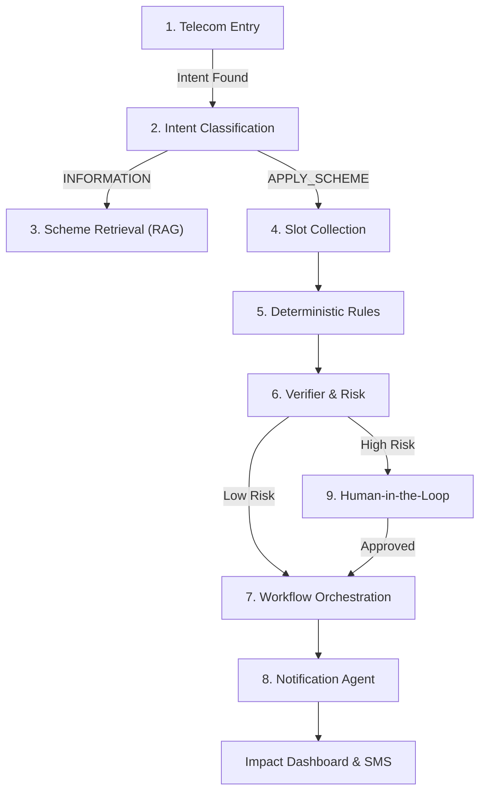

# 🧠 JanSathi Agent Architecture

> **Telecom-Native Civic Infrastructure for Bharat**

JanSathi utilizes a **deterministic 9-agent pipeline** designed for reliability, scalability, and inclusion. Unlike traditional "black-box" AI, this architecture combines Large Language Models (LLMs) with hard-coded business rules to ensure government-safe outcomes.

---

## 🏗️ The 9-Agent Pipeline



---

## Detailed Agent Specifications

1️⃣ **Telecom Entry Agent**
(Amazon Connect + connect_webhook.py)

**Role**: Telecom-native interface layer.

**What it handles**:

- Incoming call
- Language selection
- Consent capture
- ASR capture
- DTMF fallback
- Audio response formatting

**It DOES NOT**:

- Do reasoning
- Decide eligibility
- Validate rules

**Output**:

```json
{
  "session_id": "...",
  "language": "hi",
  "transcript": "pm kisan apply",
  "confidence": 0.84,
  "channel": "ivr"
}
```

**AWS Used**: Amazon Connect, Lambda, Polly, Transcribe.

This agent ensures inclusion.

---

2️⃣ **Intent Classification Agent**
(intent_service.py – Bedrock Haiku + rule fallback)

**Role**: Classify intent safely and deterministically.

**Possible intents**:

- APPLY_SCHEME
- CHECK_STATUS
- GRIEVANCE
- INFORMATION
- UNKNOWN

**It must**:

- Return structured JSON
- Provide confidence
- Use rule fallback if Bedrock fails

**Output**:

```json
{
  "intent": "APPLY_SCHEME",
  "scheme": "PM-KISAN",
  "confidence": 0.91
}
```

**Guardrails**: If confidence < 0.6 → escalate or clarify.

This agent routes the system.

---

3️⃣ **Scheme Retrieval Agent**
(RAG Agent – Kendra + Bedrock)

**Role**: Retrieve authoritative scheme information.

**Responsibilities**:

- Query Kendra
- Retrieve grounded text
- Generate citation-based response
- Never hallucinate

**Output**:

```json
{
  "answer": "...",
  "sources": ["Ministry PDF Page 3"]
}
```

Used only for INFORMATION queries.

---

4️⃣ **Slot Collection Agent**
(ivr_service.py + workflow_engine.py)

**Role**: Structured data collection engine.

**It**:

- Reads scheme schema from `schemes_config.yaml`
- Identifies missing slots
- Prompts user
- Validates format
- Supports DTMF fallback

**It DOES NOT**:

- Decide eligibility
- Submit anything

**Example schema-driven logic**:

```yaml
PM-KISAN:
  required_slots: - land_hectares - income - state
```

**Output**:

```json
{
  "missing_slots": ["income"],
  "next_prompt": "Please tell your annual income."
}
```

---

5️⃣ **Deterministic Rules Agent**
(workflow_engine.py RulesEngine)

**Role**: Truth engine.

**It**:

- Evaluates eligibility
- Uses hard-coded rule conditions
- Overrides AI outputs if needed
- Provides reason trace

**Output**:

```json
{
  "eligible": true,
  "reasons": ["Land < 2 hectares", "Income < 2L"]
}
```

This is what makes you government-safe.

---

6️⃣ **Verifier & Risk Agent**
(Guardrails + confidence layer)

**Role**: Final safety check before completion.

**Checks**:

- Confidence threshold
- Slot completeness
- Rule consistency
- PII validation
- ASR clarity

**If risk**: → Create HITL case
**If safe**: → Proceed

This prevents false positives.

---

7️⃣ **Workflow Orchestration Agent**
(Step Functions)

**Role**: State machine controller.

**Manages**:

- Slot collection
- Validation
- Eligibility evaluation
- HITL branch
- Notify branch

This agent never reasons. It just moves state.

---

8️⃣ **Notification Agent**
(notify_service.py – SNS)

**Role**: Communications layer.

**Responsibilities**:

- Send SMS summary
- Send eligibility confirmation
- Send checklist
- Send grievance draft

**If SNS fails**: → Console fallback

This closes the loop.

---

9️⃣ **Human-in-the-Loop Agent**
(hitl_service.py + Admin Dashboard)

**Role**: Escalation & override authority.

**Triggers when**:

- ASR too noisy
- Confidence < threshold
- Rule conflict
- User requests human

**Admin sees**:

- Transcript
- Slot values
- Eligibility result
- Can approve or edit

This adds institutional trust.

---

## 🔥 What You DO NOT Need Now

❌ Federated learning agent
❌ Market integration agent
❌ Auto-submission bot
❌ Multi-agent reasoning drama
❌ Complex government API connectors

You only need what aligns to:
**Voice → Eligibility → Checklist → SMS → Dashboard**

---

## 🧩 Clean Agent Interaction Flow (Apply Flow)

1. Telecom Entry Agent
2. Intent Agent
3. Slot Collection Agent
4. Rules Agent
5. Verifier Agent
6. Workflow Agent
7. Notification Agent
8. Dashboard Update
9. HITL (if needed)

Clean. Linear. Deterministic.
