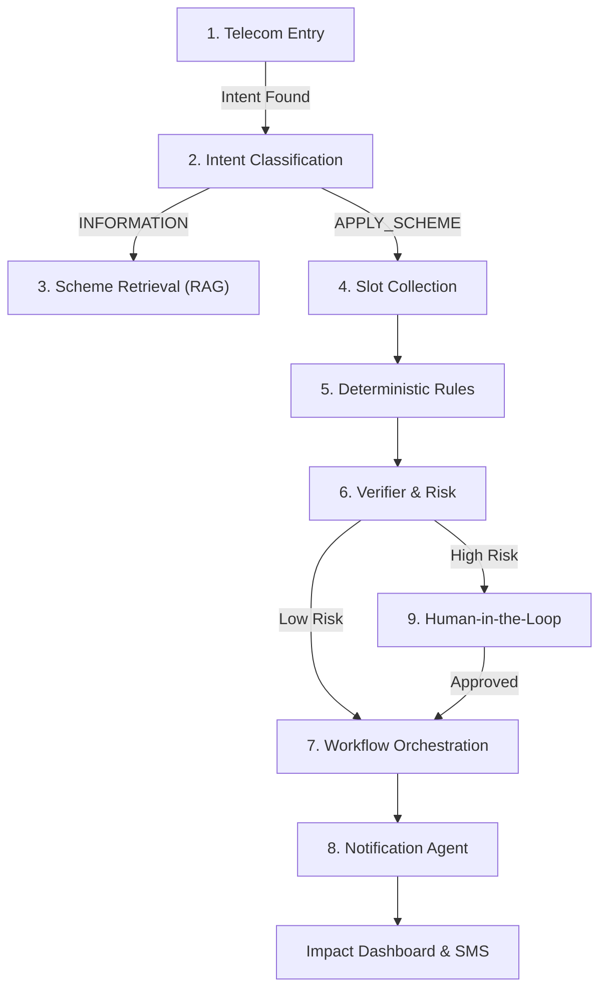

# 💡 The JanSathi Vision

> **Building Agentic Telecom-Native Civic Readiness Infrastructure for India**

JanSathi addresses the critical gap in inclusion and accessibility for public services in India. Our mission is to leverage AI not as a replacement for human services, but as an expansive "Civic Readiness" layer that works through high-accessibility channels.

---

## �️ 9-Agent Architecture & User Flow

---

## �🏜️ Problem Statement

**Build an AI-powered solution that improves access to information, resources, or opportunities for communities and public systems.**

In India, millions of citizens remain on the digital periphery due to:

- **Language Barriers**: Information is often and restricted to English or Standard Hindi.
- **Connectivity Gaps**: High-bandwidth apps are unusable in low-connectivity rural belts.
- **Complexity**: Government scheme eligibility rules are dense and difficult to parse.

---

## 🚀 The JanSathi Solution: "Agentic Civic Readiness"

JanSathi is a **Telecom-Native** solution. It brings the power of Agentic AI to the simplest possible interface: **The Voice Call.**

### 💎 Key Values

1. **Inclusion**: Voice-first, local-language, and low-bandwidth. If you have a basic feature phone, you have JanSathi.
2. **Institutional Trust**: Combines the reasoning of LLMs (Bedrock) with the absolute certainty of **Deterministic Rules**.
3. **Transparency**: Every decision is audited and trace-backed, ensuring the system is accountable for the advice it gives.

---

## 🌍 Community & Societal Impact

JanSathi's reach extends beyond just "information retrieval." It acts as a bridge for:

- **Farmers**: Understanding land-holding benefits (e.g., PM-Kisan) without traveling to district offices.
- **Workers**: Verifying eligibility for labor and insurance schemes.
- **Communities**: A shared "Civic Forum" to share success stories and grievance updates.

---

## 📈 Future Strategic Horizons (Post-MVP)

While we are currently focused on the **IVR → Eligibility → SMS** loop, JanSathi is designed to eventually scale into:

- **Market Connect**: Real-time matching for farmers with procurement centers.
- **Proactive Notifications**: Alerting citizens when new schemes align with their stored anonymized profile.
- **Cross-District Analytics**: Providing government stakeholders with heatmaps of high-need areas.

---

# 🛰️ Detailed User Flow (Complete call-to-close)

Below is a single, end-to-end walkthrough (user perspective) **and** the technical architecture that runs it (IVR → AWS → backend agents → frontend).

### Quick summary (one line)

A user calls a toll-free JanSathi IVR → Connect records language & consent → Short ASR → Supervisor classifies intent → Slot collection workflow (DTMF fallback) → Deterministic rules verify eligibility → System either queues HITL or submits a case/stores readiness → Notification agent sends SMS with BenefitReceipt → IVR plays final message and call ends. Dashboard updates in real time.

---

### User experience flow (what the person sees/hears)

1. **Call**: The user dials the JanSathi toll-free number.
2. **Welcome & Consent**: “Namaste. This call may collect personal information for benefits assistance. Press 1 to consent.” (DTMF)
3. **Language selection**: “Press 1 for Hindi, 2 for English, 3 for Tamil.”
4. **Short natural query**: “Please tell me how I can apply for PM-Kisan.” (Short spoken sentence)
5. **IVR confirmation**: “Okay — I will ask 3 quick questions to check eligibility.”
6. **Slot collection**: Prompts for land size, income; user answers by voice or presses digits.
7. **Realtime validation**: System says “You appear eligible” or “You are not eligible because…”
8. **Summary & SMS**: IVR: “We will send an SMS with a checklist and next steps.” User hears it. SMS arrives with BenefitReceipt link.
9. **Call end**: IVR says “Dhanyavaad — you will receive SMS. Goodbye.” Call disconnects.
10. **Dashboard**: Admin/judges see session, telemetry, BenefitReceipt, and case ID; if HITL needed, reviewer takes action.

---

# Architectural components (Detailed)

- **IVR / Telecom**: Amazon Connect (contact flow), Amazon Polly (TTS), Amazon Transcribe (ASR).
- **Orchestration & Agents** (backend Lambdas + Step Functions):
  - Telecom Entry Agent (connect_webhook.py)
  - Intent Classification Agent (intent_service.py)
  - Slot Collection Agent (ivr_service.py + workflow_engine.py)
  - Deterministic Rules Agent (RulesEngine in workflow_engine.py)
  - Verifier & HITL Agent (hitl_service.py)
  - Submission/Gov-Adapter (submission stubs)
  - Notification Agent (notify_service.py)
  - RAG Knowledge Agent (Kendra + Bedrock for info queries)

- **LLM**: Amazon Bedrock (Haiku for intent, Sonnet for complex summarization).
- **Storage**: DynamoDB (sessions, HITL queue, cases), S3 (audio, receipts, docs).
- **Frontend**: Next.js 15 (Dashboard, HITL admin, IVR Monitor, Chat UI).
- **Security & Compliance**: JWT auth, consent logging, PII tokenization, KMS encryption, SHA-256 audit.

---

> "Empowering the next 500 million through agentic inclusion."
