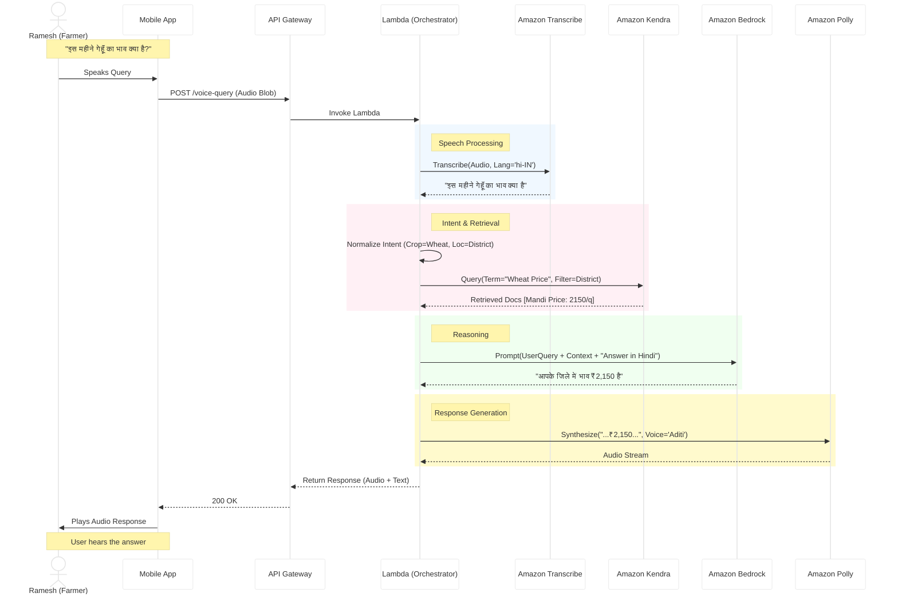

# JanSathi Sequence Diagram - Voice Query

```mermaid
%%{init: {'theme': 'base', 'themeVariables': { 'primaryColor': '#ffffff', 'edgeLabelBackground':'#ffffff', 'tertiaryColor': '#ffffff', 'mainBkg': '#ffffff', 'clusterBkg': '#ffffff', 'nodeBorder': '#000000', 'clusterBorder': '#000000', 'lineColor': '#000000'}}}%%
sequenceDiagram
    actor User as Ramesh (Farmer)
    participant Client as Mobile App
    participant GW as API Gateway
    participant Orch as Lambda (Orchestrator)
    participant STT as Amazon Transcribe
    participant RAG as Amazon Kendra
    participant LLM as Amazon Bedrock
    participant TTS as Amazon Polly

    Note over User, Client: "इस महीने गेहूँ का भाव क्या है?"

    User->>Client: Speaks Query
    Client->>GW: POST /voice-query (Audio Blob)
    GW->>Orch: Invoke Lambda

    rect rgb(240, 248, 255)
        Note right of Orch: Speech Processing
        Orch->>STT: Transcribe(Audio, Lang='hi-IN')
        STT-->>Orch: "इस महीने गेहूँ का भाव क्या है"
    end

    rect rgb(255, 240, 245)
        Note right of Orch: Intent & Retrieval
        Orch->>Orch: Normalize Intent (Crop=Wheat, Loc=District)
        Orch->>RAG: Query(Term="Wheat Price", Filter=District)
        RAG-->>Orch: Retrieved Docs [Mandi Price: 2150/q]
    end

    rect rgb(240, 255, 240)
        Note right of Orch: Reasoning
        Orch->>LLM: Prompt(UserQuery + Context + "Answer in Hindi")
        LLM-->>Orch: "आपके जिले में भाव ₹2,150 है"
    end

    rect rgb(255, 250, 205)
        Note right of Orch: Response Generation
        Orch->>TTS: Synthesize("...₹2,150...", Voice='Aditi')
        TTS-->>Orch: Audio Stream
    end

    Orch-->>GW: Return Response (Audio + Text)
    GW-->>Client: 200 OK
    Client->>User: Plays Audio Response

    Note over User, Client: User hears the answer
```
